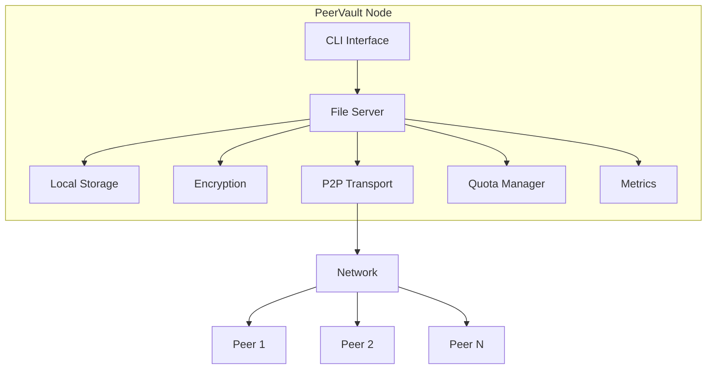
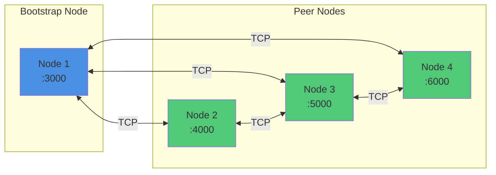
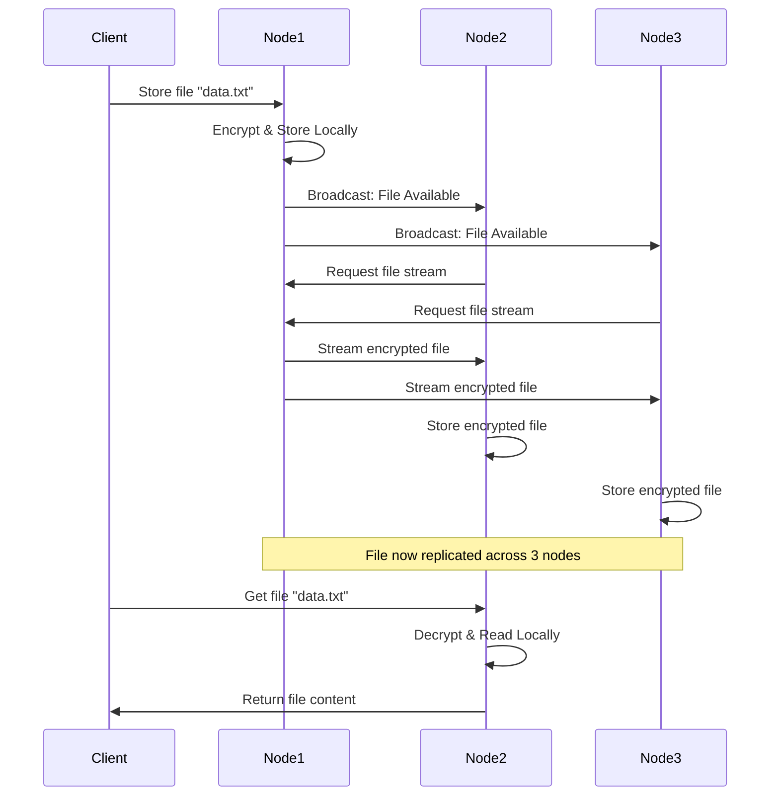

# PeerVault

A distributed peer-to-peer file storage system built in Go with encryption, automatic replication, and comprehensive monitoring. PeerVault is a production-ready, decentralized file storage system designed for secure and resilient data distribution across peer-to-peer networks. Built entirely in Go with zero external dependencies, it provides enterprise-grade features in a lightweight, easy-to-deploy package.

### What is PeerVault?

At its core, PeerVault creates a distributed storage network where files are automatically replicated across multiple nodes. When you store a file on any node, it's immediately encrypted with AES-256 encryption and propagated to all connected peers. This ensures your data remains available even if individual nodes go offline or fail.

### How It Works

1. **Content-Addressable Storage**: Files are identified by their SHA-256 hash, ensuring data integrity and deduplication
2. **Automatic Replication**: When a file is stored, it's broadcast to all connected peers who automatically fetch and store it
3. **Peer Discovery**: Nodes can find each other through manual bootstrap configuration, local network discovery (mDNS), or peer exchange (PEX)
4. **Encryption Layer**: All files are encrypted before storage and network transmission, ensuring data privacy
5. **Streaming Architecture**: Files are transferred using streaming I/O, allowing efficient handling of files of any size with constant memory usage

### Use Cases

PeerVault is ideal for scenarios requiring distributed, fault-tolerant storage:

- **Distributed Backup Systems**: Replicate critical data across multiple geographic locations with automatic integrity verification
- **Edge Computing**: Store data close to edge nodes for low-latency access with built-in monitoring
- **Development & CI/CD**: Share build artifacts across distributed build nodes with automatic cleanup
- **Content Distribution**: Create CDN-like networks for media distribution with bandwidth tracking
- **Collaborative Workflows**: Share files across distributed teams with real-time replication

## Key Features

### Core Storage & Security

- **Distributed Storage**: Files are automatically replicated across all connected peer nodes in real-time. When you store a file on one node, it's immediately broadcast to the network, ensuring redundancy and high availability. Even if multiple nodes fail, your data remains accessible from surviving peers.

- **AES-256 Encryption**: Industry-standard encryption protects your data at rest and in transit. Every file is encrypted before being written to disk or sent over the network. Configurable encryption keys ensure you maintain full control over your data security.

- **Content-Addressable Storage (CAS)**: Files are organized and identified by their SHA-256 hash, creating a tamper-proof storage system. This approach enables automatic deduplication, ensures data integrity, and allows for efficient file retrieval across the network.

### Network & Discovery

- **Flexible Peer Discovery**: Multiple discovery mechanisms ensure nodes can find each other in any environment:
  - **Manual Bootstrap**: Traditional approach for internet-deployed nodes
  - **mDNS Local Discovery**: Zero-configuration automatic discovery on local networks
  - **Peer Exchange (PEX)**: Gossip-based protocol where nodes learn about peers from their existing connections, enabling organic network growth

- **Resilient Networking**: Built-in auto-reconnection, configurable timeouts, and retry mechanisms ensure stable connections. Supports NAT traversal with separate listen and advertise addresses for complex network topologies.

### Resource Management

- **Storage Quotas**: Prevent disk space exhaustion with configurable storage limits. Interactive quota setup on first run, real-time usage tracking, and smart cleanup prompts when approaching limits. Quotas are enforced before accepting new files, ensuring predictable resource usage.

- **Garbage Collection**: Automated background process runs hourly to verify file integrity by recalculating SHA-256 hashes. Automatically removes corrupted files and orphaned data, maintaining storage health without manual intervention.

- **Streaming I/O**: Memory-efficient architecture uses streaming for all file operations. Transfer files of any size while using only ~32KB of memory per operation, making PeerVault suitable for resource-constrained environments.

### Monitoring & Observability

- **Prometheus Metrics**: Comprehensive metrics tracking for production deployments:
  - File operations (stored, retrieved, deleted)
  - Network statistics (bytes sent/received, peer connections)
  - Storage utilization (used, total, percentage)
  - System health (errors, uptime)

  Metrics available in Prometheus, JSON, and human-readable formats via HTTP endpoints.

- **Health Checks**: Built-in peer health monitoring tracks last-seen timestamps and connection status. Automatic detection of stale or disconnected peers helps maintain network health.

## Quick Start

```bash
# 1. Build
make build

# 2. Start first node
./bin/peervault -addr :3000 -metrics :9090 -discover-local -interactive

# 3. Start second node (in another terminal)
./bin/peervault -addr :4000 -bootstrap localhost:3000 -discover-local -interactive

# 4. Store and retrieve files
PeerVault> store myfile.txt
PeerVault> list
PeerVault> get myfile.txt
```

## Installation

### Prerequisites

- Go 1.25.6 or higher
- Make (optional)
- Network connectivity between nodes

### Build

```bash
git clone https://github.com/AdityaKrSingh26/PeerVault.git
cd PeerVault
make build
```

## Configuration

### Environment Variables

```bash
export PEERVAULT_KEY='your-32-byte-secure-encryption-key-here'
```

### Command-Line Flags

| Flag                  | Description                     | Default            |
| --------------------- | ------------------------------- | ------------------ |
| `-addr`               | Listen address                  | `:3000`            |
| `-advertise`          | Address to advertise to peers   | Auto-detected      |
| `-bootstrap`          | Comma-separated bootstrap nodes | None               |
| `-public-ip`          | Auto-detect public IP           | `false`            |
| `-key`                | Encryption key (32 bytes)       | Default (insecure) |
| `-interactive`        | Enable interactive mode         | `false`            |
| `-verbose` / `-debug` | Enable debug logging            | `false`            |
| `-metrics`            | Metrics server address          | Disabled           |
| `-discover-local`     | Enable mDNS local discovery     | `false`            |
| `-discover-pex`       | Enable peer exchange            | `false`            |

## Usage

### Basic Deployment

**Single Node:**

```bash
./bin/peervault -addr :3000
```

**Multi-Node with Auto-Discovery:**

```bash
# Node 1
./bin/peervault -addr :3000 -discover-local -interactive

# Node 2
./bin/peervault -addr :4000 -discover-local -interactive
```

**Internet Deployment:**

```bash
# Bootstrap node
export PEERVAULT_KEY='production-key'
./bin/peervault -addr :3000 -public-ip -discover-pex

# Client node
export PEERVAULT_KEY='production-key'
./bin/peervault -addr :3000 -bootstrap 203.0.113.5:3000 -discover-pex
```

### Peer Discovery

**1. Manual Bootstrap** - Specify bootstrap nodes manually

```bash
./bin/peervault -addr :3000 -bootstrap peer1:3000,peer2:3000
```

**2. Local Discovery (mDNS)** - Zero-config discovery on LANs

```bash
./bin/peervault -addr :3000 -discover-local
```

**3. Peer Exchange (PEX)** - Learn peers from existing connections

```bash
./bin/peervault -addr :3000 -discover-pex -bootstrap initial-peer:3000
```

**Combine All Methods:**

```bash
./bin/peervault -addr :3000 -bootstrap seed:3000 -discover-local -discover-pex
```

### Interactive Commands

```
store <filename>        - Store a file
get <filename>          - Retrieve a file
delete <filename>       - Delete from network
list                    - List all files
quota                   - Show storage quota
metrics                 - Show metrics
peers                   - Show connected peers
discover                - Show discovery status
status                  - Show server status
help                    - Show all commands
quit                    - Exit
```

#### Example Session

```bash
PeerVault> status
Server listening on: :3000
Local IP: 192.168.1.100
Connected peers: 2

PeerVault> peers
Connected Peers (2):
┌───────────────────────────┬─────────────┬────────────────┐
│ Address                   │ Status      │ Last Seen      │
├───────────────────────────┼─────────────┼────────────────┤
│ 192.168.1.101:3000        │ ✓ Healthy   │ 5s ago         │
│ 192.168.1.102:3000        │ ✓ Healthy   │ 8s ago         │
└───────────────────────────┴─────────────┴────────────────┘

PeerVault> store document.txt
File 'document.txt' stored successfully

PeerVault> list
Files stored on this node (1 files):
┌─────────────────────────────────────┬─────────────┬──────────────────────┐
│ Filename                            │ Size (bytes)│ Hash (first 8 chars) │
├─────────────────────────────────────┼─────────────┼──────────────────────┤
│ document.txt                        │        2048 │ a3b5c7d9             │
└─────────────────────────────────────┴─────────────┴──────────────────────┘

PeerVault> get document.txt
File 'document.txt' retrieved successfully

PeerVault> delete old_file.txt
Are you sure you want to delete 'old_file.txt'? This will remove it from all nodes. (y/N): y
File 'old_file.txt' deleted successfully from all nodes

PeerVault> discover

=== Peer Discovery Status ===
mDNS Discovered Peers: 2
  - 192.168.1.105:3000
  - 192.168.1.106:4000

Peer Exchange (PEX): 5 known peers
  bootstrap: 1 peers
  mdns: 2 peers
  pex: 2 peers

PeerVault> metrics
=== PeerVault Metrics ===

File Operations:
  Stored:     15
  Retrieved:  8
  Deleted:    2

Network:
  Bytes Sent:     256.45 MB
  Bytes Received: 189.32 MB
  Peers Connected: 3

Storage:
  Used:        1.23 GB
  Total:       5.00 GB
  Utilization: 24.6%

System:
  Errors:  0
  Uptime:  2h 34m
  Started: 2026-02-05 14:30:00
```

### Storage Quota

On first startup, configure your storage quota:

```
Enter maximum storage size (e.g., 1GB, 500MB, 10GB): 5GB
```

Check quota status:

```bash
PeerVault> quota
=== Storage Quota ===
Used:      2.34 GB
Total:     5.00 GB
Available: 2.66 GB
Usage:     46.8%
```

### Metrics & Monitoring

Enable metrics server:

```bash
./bin/peervault -addr :3000 -metrics :9090
```

**Endpoints:**

- `http://localhost:9090/` - Web dashboard
- `http://localhost:9090/metrics` - Prometheus format
- `http://localhost:9090/metrics/json` - JSON format
- `http://localhost:9090/health` - Health check

## Architecture



### Network Topology



### File Replication Flow



## Project Structure

```
PeerVault/
├── cmd/peervault/          # CLI application
├── internal/               # Private packages
│   ├── crypto/            # AES-256 encryption
│   ├── metrics/           # Metrics collection
│   ├── network/           # File server & discovery
│   ├── quota/             # Storage quota management
│   └── storage/           # Content-addressable storage
├── pkg/p2p/               # P2P networking library
├── Makefile
└── README.md
```

## Testing

```bash
# Run all tests
make test

# Test coverage
make test-coverage

# Multi-node test
make test-multinode
```

## Performance

- **Memory Usage**: Constant ~32KB per transfer (streaming)
- **Encryption**: AES-256-CTR mode
- **Hash Algorithm**: SHA-256
- **GC Interval**: Every 1 hour
- **PEX Interval**: Every 5 minutes
- **Optimal Peers**: 3-7 for best balance

## Security

- Always use environment variables for encryption keys in production
- Use firewall rules to restrict P2P port access
- Secure metrics endpoint with authentication
- Consider VPN for network-level encryption
- No built-in TLS or authentication (implement at network level)

## Repository

https://github.com/AdityaKrSingh26/PeerVault
