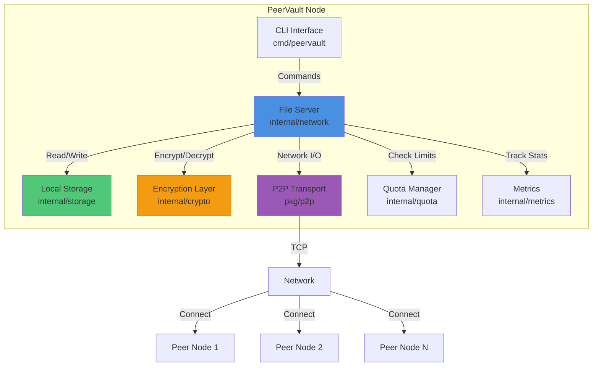
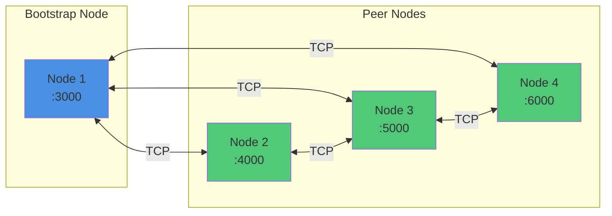
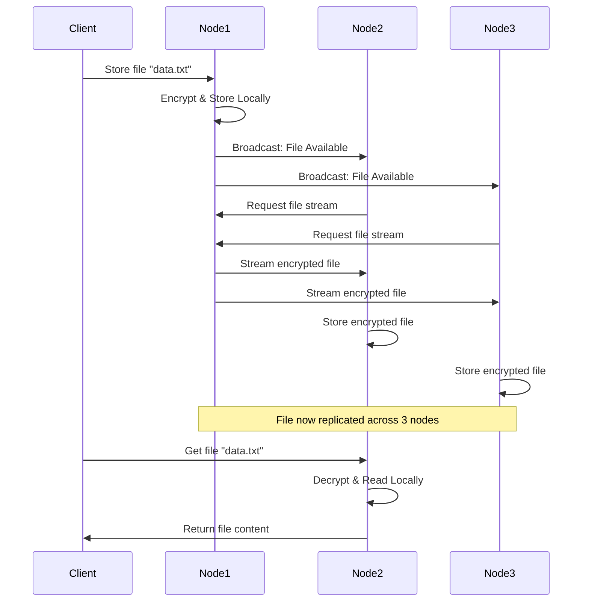

# PeerVault

A distributed peer-to-peer file storage system built in Go. PeerVault enables secure, redundant file storage across a network of nodes with built-in encryption, automatic replication, and comprehensive monitoring.

## Table of Contents

- [Overview](#overview)
- [Use Cases](#use-cases)
- [Architecture](#architecture)
- [Features](#features)
- [Prerequisites](#prerequisites)
- [Installation](#installation)
- [Quick Start](#quick-start)
- [Configuration](#configuration)
- [Usage](#usage)
- [Advanced Features](#advanced-features)
  - [File Deletion](#file-deletion)
  - [Storage Quota Details](#storage-quota-details)
  - [Garbage Collection Details](#garbage-collection-details)
  - [Metrics System Details](#metrics-system-details)
  - [Production Deployment](#production-deployment)
- [Network Topology](#network-topology)
- [Testing](#testing)
- [Project Structure](#project-structure)
- [API Reference](#api-reference)
- [Best Practices](#best-practices)
- [FAQ](#faq)
- [Contributing](#contributing)

## Overview

PeerVault is a production-ready decentralized file storage system that distributes files across multiple network nodes. Each file is encrypted using AES-256, replicated to connected peers, and remains accessible even if individual nodes become unavailable. The system uses a custom TCP-based protocol for efficient peer-to-peer communication.

**Recent improvements:** The codebase has been refactored to follow Go project layout best practices (cmd/, internal/, pkg/) and simplified to remove unnecessary complexity while maintaining all core functionality.

## Use Cases

PeerVault is designed for scenarios where you need secure, distributed storage with enterprise features:

1. **Distributed Backup Systems**
   - Replicate backups across multiple geographic locations
   - Automatic integrity verification ensures backup validity
   - Storage quotas prevent runaway disk usage

2. **Edge Computing**
   - Store data close to edge nodes for low-latency access
   - Metrics integration enables fleet-wide monitoring
   - Health checks ensure high availability

3. **Development & Testing**
   - Share build artifacts across CI/CD nodes
   - Temporary file storage with automatic cleanup
   - Isolated storage per team with quota management

4. **Content Distribution**
   - Distribute media files across CDN-like network
   - Bandwidth tracking via metrics
   - Network-wide cache invalidation via delete

5. **Collaborative Workflows**
   - Share files across distributed teams
   - Real-time replication to all team members
   - Storage quotas prevent resource abuse

6. **Research & Academia**
   - Share datasets across research institutions
   - Cryptographic integrity verification
   - Detailed metrics for resource accounting

**What makes PeerVault unique:**
- ✅ **Enterprise-grade**: Storage quotas, garbage collection, and comprehensive metrics
- ✅ **Production-ready**: Automatic integrity verification and corruption detection
- ✅ **Observable**: Prometheus-compatible metrics with JSON and human-readable formats
- ✅ **Resilient**: Auto-reconnection and robust error handling
- ✅ **Efficient**: Streaming I/O for constant memory usage regardless of file size
- ✅ **Secure**: AES-256 encryption with SHA-256 hashing throughout
- ✅ **Well-organized**: Clean Go project structure following best practices

### Feature Comparison

| Feature | PeerVault | IPFS | Storj | MinIO |
|---------|-----------|------|-------|-------|
| P2P Architecture | ✅ | ✅ | ✅ | ❌ |
| Local Discovery (mDNS) | ✅ | ❌ | ❌ | ❌ |
| Peer Exchange (PEX) | ✅ | ❌ | ❌ | ❌ |
| Storage Quotas | ✅ | ❌ | ✅ | ✅ |
| Automatic Replication | ✅ | ✅ | ✅ | ✅ |
| Encryption (AES-256) | ✅ | Optional | ✅ | ✅ |
| Integrity Verification | ✅ Auto | Manual | ✅ | Manual |
| Prometheus Metrics | ✅ | ✅ | ✅ | ✅ |
| Interactive CLI | ✅ | ✅ | ❌ | ✅ |
| Network-wide Deletion | ✅ | ❌ | ✅ | ✅ |
| Garbage Collection | ✅ Auto | Manual | ✅ | Manual |
| Memory Efficient | ✅ Streaming | ❌ | ✅ | ✅ |
| Setup Complexity | Low | Medium | High | Low |
| Dependencies | None | Many | Many | None |

## Architecture

PeerVault uses a modular, layered architecture with clear separation of concerns:



## Features

### Core Functionality
- **Distributed Storage**: Files automatically replicate across connected peer nodes
- **Content-Addressable Storage**: SHA-256 hashing for efficient file organization
- **AES-256 Encryption**: All files encrypted before storage and network transmission
- **Streaming Support**: Memory-efficient handling of large files through streaming I/O
- **Progress Tracking**: Real-time progress reporting for file transfers over 1MB

### Network Capabilities
- **Local Discovery (mDNS)**: Zero-configuration peer discovery on local networks
- **Peer Exchange (PEX)**: Learn about peers from connected nodes
- **Bootstrap Nodes**: Manual configuration for initial connections
- **Auto-Reconnection**: Automatic reconnection to failed bootstrap nodes
- **NAT Traversal**: Support for listen vs. advertise address configuration
- **Public IP Detection**: Automatic detection of external IP for internet deployment
- **Connection Resilience**: Configurable timeouts, retries, and error recovery

### Security
- **Configurable Encryption**: 32-byte AES-256 keys via environment variables or command-line flags
- **SHA-256 Hashing**: Cryptographically secure file identification
- **Secure Key Management**: No hardcoded credentials in production

### Storage Management
- **Storage Quotas**: Interactive quota configuration on first startup
- **Usage Tracking**: Real-time storage usage monitoring
- **Smart Cleanup**: Prompts for file deletion when quota exceeded
- **File Deletion**: Remove files across the entire network
- **Garbage Collection**: Automatic integrity verification and cleanup

### Monitoring & Metrics
- **Prometheus Metrics**: Export metrics in Prometheus format
- **JSON API**: Programmatic access to metrics
- **HTTP Dashboard**: Web-based metrics viewing
- **Real-time Stats**: Track files, transfers, storage, and errors

### CLI Features
- **Interactive Mode**: Full-featured command-line interface
- **Peer Management**: View connected peers with health status
- **Direct Transfers**: Send files to specific peers
- **Targeted Retrieval**: Fetch files from specific peers
- **Quota Management**: View and manage storage quotas
- **Metrics Display**: View detailed server metrics
- **Debug Mode**: Verbose logging for troubleshooting

## Prerequisites

- Go 1.25.6 or higher
- Make (optional, for using Makefile commands)
- Network connectivity between nodes
- Open ports for P2P communication (default: 3000)

## Installation

### Clone the Repository

```bash
git clone https://github.com/AdityaKrSingh26/PeerVault.git
cd PeerVault
```

### Build from Source

```bash
# Using Make
make build

# Or using Go directly
go build -o bin/peervault
```

### Verify Installation

```bash
./bin/peervault -h
```

## Quick Start

Get up and running with PeerVault in 5 minutes:

```bash
# 1. Build the project
make build

# 2. Start first node with all features enabled (including peer discovery)
./bin/peervault -addr :3000 -metrics :9090 -discover-local -discover-pex -interactive

# First time setup - configure storage quota:
# Enter maximum storage size (e.g., 1GB, 500MB, 10GB): 5GB

# 3. In another terminal, start second node with discovery enabled
./bin/peervault -addr :4000 -bootstrap localhost:3000 -metrics :9091 -discover-local -discover-pex -interactive

# 4. Try it out in Node 1's interactive mode:
PeerVault> store myfile.txt
File 'myfile.txt' stored successfully

PeerVault> list
Files stored on this node (1 files):
│ myfile.txt                        │        2048 │ a3b5c7d9            │

PeerVault> quota
=== Storage Quota ===
Used:      2.00 KB
Total:     5.00 GB
Available: 5.00 GB
Usage:     0.0%

PeerVault> metrics
=== PeerVault Metrics ===
File Operations:
  Stored:     1
  Retrieved:  0
  Deleted:    0
Network:
  Peers Connected: 1

PeerVault> peers
Connected Peers (1):
│ localhost:4000                │ ✓ Healthy   │ 5s ago         │

# 5. View metrics dashboard in browser
# Open http://localhost:9090

# 6. Check Prometheus metrics
curl http://localhost:9090/metrics
```

That's it! You now have a fully functional P2P storage network with monitoring.

## Configuration

### Environment Variables

```bash
# Encryption key (32 bytes for AES-256)
export PEERVAULT_KEY='your-32-byte-secure-encryption-key-here'
```

### Command-Line Flags

| Flag | Description | Default | Example |
|------|-------------|---------|---------|
| `-addr` | Listen address | `:3000` | `-addr :3000` |
| `-advertise` | Address to advertise to peers | Auto-detected | `-advertise 203.0.113.5:3000` |
| `-bootstrap` | Comma-separated bootstrap nodes | None | `-bootstrap 192.168.1.100:3000,10.0.0.50:4000` |
| `-public-ip` | Auto-detect public IP | `false` | `-public-ip` |
| `-key` | Encryption key (32 bytes) | Default (insecure) | `-key "your-32-byte-key"` |
| `-interactive` | Enable interactive mode | `false` | `-interactive` |
| `-verbose` / `-debug` | Enable debug logging | `false` | `-verbose` |
| `-metrics` | Metrics server address | Disabled | `-metrics :9090` |
| `-discover-local` | Enable mDNS local discovery | `false` | `-discover-local` |
| `-discover-pex` | Enable peer exchange (PEX) | `false` | `-discover-pex` |
| `-demo` | Run demo mode | `false` | `-demo` |

## Usage

### Basic Deployment

#### Single Node (Standalone)

```bash
./bin/peervault -addr :3000
```

#### Multi-Node Local Network (Manual Bootstrap)

**Node 1 (Bootstrap):**
```bash
./bin/peervault -addr :3000
```

**Node 2:**
```bash
./bin/peervault -addr :4000 -bootstrap localhost:3000
```

**Node 3:**
```bash
./bin/peervault -addr :5000 -bootstrap localhost:3000
```

#### Multi-Node Local Network (Automatic Discovery)

With mDNS local discovery, nodes automatically find each other on the same network:

**Node 1:**
```bash
./bin/peervault -addr :3000 -discover-local -interactive
```

**Node 2:**
```bash
./bin/peervault -addr :4000 -discover-local -interactive
```

**Node 3:**
```bash
./bin/peervault -addr :5000 -discover-local -interactive
```

No bootstrap configuration needed! Nodes will discover each other automatically within seconds.

#### Internet Deployment

**Public Server (Bootstrap Node):**
```bash
export PEERVAULT_KEY='production-secure-32byte-key'
./bin/peervault -addr :3000 -public-ip
```

**Client Behind NAT:**
```bash
export PEERVAULT_KEY='production-secure-32byte-key'
./bin/peervault -addr :3000 -bootstrap 203.0.113.5:3000
```

**Client with Port Forwarding:**
```bash
export PEERVAULT_KEY='production-secure-32byte-key'
./bin/peervault -addr :3000 -advertise <your-public-ip>:3000 -bootstrap 203.0.113.5:3000
```

### Peer Discovery

PeerVault supports three methods for discovering and connecting to peers:

#### 1. Manual Bootstrap (Traditional)

Manually specify one or more bootstrap nodes:

```bash
./bin/peervault -addr :3000 -bootstrap peer1.example.com:3000,peer2.example.com:4000
```

**Pros:** Simple, predictable, works across any network
**Cons:** Requires manual configuration, doesn't discover new peers dynamically

#### 2. Local Network Discovery (mDNS)

Zero-configuration discovery on local networks using multicast DNS:

```bash
./bin/peervault -addr :3000 -discover-local -interactive
```

**How it works:**
- Nodes broadcast their presence on the local network
- Other nodes with `-discover-local` automatically discover and connect
- Works within the same LAN/VLAN (doesn't cross routers)
- No configuration needed

**Best for:**
- Home networks
- Office LANs
- Development environments
- Local testing

**Example - Start 3 nodes that auto-discover each other:**
```bash
# Terminal 1
./bin/peervault -addr :3000 -discover-local -interactive

# Terminal 2
./bin/peervault -addr :4000 -discover-local -interactive

# Terminal 3
./bin/peervault -addr :5000 -discover-local -interactive

# All three nodes will automatically find and connect to each other!
```

#### 3. Peer Exchange (PEX)

Learn about new peers from your existing connections:

```bash
./bin/peervault -addr :3000 -discover-pex -bootstrap initial-peer:3000
```

**How it works:**
- Every 5 minutes, peers exchange lists of known peers
- Automatically attempts connections to newly learned peers
- Keeps peer list fresh (removes peers not seen in 30 minutes)
- Tracks peer source (bootstrap, mdns, pex)

**Best for:**
- Growing networks organically
- Internet-deployed nodes
- Networks where not all peers know each other initially
- Distributed/decentralized topologies

**Example - PEX in action:**
```bash
# Bootstrap node
./bin/peervault -addr :3000 -discover-pex -interactive

# Node A connects to bootstrap
./bin/peervault -addr :4000 -discover-pex -bootstrap localhost:3000

# Node B connects to bootstrap
./bin/peervault -addr :5000 -discover-pex -bootstrap localhost:3000

# Node C only knows about Node A
./bin/peervault -addr :6000 -discover-pex -bootstrap localhost:4000

# Result: Node C learns about bootstrap and Node B through PEX from Node A!
```

#### Combining Discovery Methods

For maximum connectivity, combine all three methods:

```bash
./bin/peervault -addr :3000 \
  -bootstrap seed.example.com:3000 \
  -discover-local \
  -discover-pex \
  -interactive
```

This configuration:
- Connects to a known bootstrap node
- Discovers peers on the local network
- Learns about new peers from existing connections

#### Checking Discovery Status

Use the `discover` command in interactive mode to see discovered peers:

```bash
PeerVault> discover

=== Peer Discovery Status ===
mDNS Discovered Peers: 3
  - 192.168.1.101:3000
  - 192.168.1.102:4000
  - 192.168.1.103:5000

Peer Exchange (PEX): 8 known peers
  bootstrap: 2 peers
  mdns: 3 peers
  pex: 3 peers
```

### Interactive Mode

Launch interactive CLI:

```bash
./bin/peervault -addr :3000 -interactive -bootstrap <bootstrap-node>
```

#### Available Commands

```
PeerVault> help

Commands:
  store <filename>        - Store a file with sample data
  get <filename>          - Retrieve and display a file
  delete <filename>       - Delete a file from the network
  list                    - List all stored files
  quota                   - Show storage quota status
  metrics                 - Show server metrics
  status                  - Show server and network status
  peers                   - Show connected peers with health status
  send <file> <peer>      - Send file to specific peer
  fetch <file> <peer>     - Fetch file from specific peer
  clean                   - Clean local storage
  quit                    - Exit PeerVault
```

#### Example Session

```bash
PeerVault> status
Server listening on: :3000
Local IP: 192.168.1.100
Connected peers: 2

PeerVault> peers
Connected Peers (2):
┌───────────────────────────┬─────────────┬────────────────┐
│ Address                   │ Status      │ Last Seen      │
├───────────────────────────┼─────────────┼────────────────┤
│ 192.168.1.101:3000       │ ✓ Healthy   │ 5s ago         │
│ 192.168.1.102:3000       │ ✓ Healthy   │ 8s ago         │
└───────────────────────────┴─────────────┴────────────────┘

PeerVault> store document.txt
File 'document.txt' stored successfully

PeerVault> list
Files stored on this node (1 files):
┌─────────────────────────────────────┬─────────────┬──────────────────────┐
│ Filename                            │ Size (bytes)│ Hash (first 8 chars) │
├─────────────────────────────────────┼─────────────┼──────────────────────┤
│ document.txt                        │        2048 │ a3b5c7d9            │
└─────────────────────────────────────┴─────────────┴──────────────────────┘

PeerVault> get document.txt
File 'document.txt' retrieved successfully

PeerVault> delete old_file.txt
Are you sure you want to delete 'old_file.txt'? This will remove it from all nodes. (y/N): y
File 'old_file.txt' deleted successfully from all nodes

PeerVault> discover

=== Peer Discovery Status ===
mDNS Discovered Peers: 2
  - 192.168.1.105:3000
  - 192.168.1.106:4000

Peer Exchange (PEX): 5 known peers
  bootstrap: 1 peers
  mdns: 2 peers
  pex: 2 peers

PeerVault> metrics
=== PeerVault Metrics ===

File Operations:
  Stored:     15
  Retrieved:  8
  Deleted:    2

Network:
  Bytes Sent:     256.45 MB
  Bytes Received: 189.32 MB
  Peers Connected: 3

Storage:
  Used:        1.23 GB
  Total:       5.00 GB
  Utilization: 24.6%

System:
  Errors:  0
  Uptime:  2h 34m
  Started: 2026-02-05 14:30:00
```

### Storage Quota Management

PeerVault includes automatic storage quota management to prevent disk space issues.

#### First Startup

On first startup, you'll be prompted to configure storage quota:

```bash
=== Storage Quota Configuration ===
This is the first time running PeerVault with this storage location.
Please configure the maximum storage quota for this node.

Enter maximum storage size (e.g., 1GB, 500MB, 10GB): 5GB
Storage quota set to: 5.00 GB (5368709120 bytes)
```

#### Quota Enforcement

When storing a file that would exceed the quota, you'll be prompted to delete old files:

```bash
⚠️  Insufficient storage space!
Required: 2.50 GB, Available: 1.20 GB (Need to free: 1.30 GB)

Files available for deletion:
┌────┬─────────────────────────────────────┬─────────────┬──────────────────────┐
│ #  │ Filename                            │ Size        │ Hash (first 8)       │
├────┼─────────────────────────────────────┼─────────────┼──────────────────────┤
│ 1  │ old_backup.zip                      │ 1.50 GB     │ a3b5c7d9            │
│ 2  │ temp_data.bin                       │ 500.00 MB   │ 3f8a9b2c            │
└────┴─────────────────────────────────────┴─────────────┴──────────────────────┘

Enter file numbers to delete (comma-separated, e.g., 1,3,5) or 'cancel': 1
```

### Metrics & Monitoring

Enable the metrics server to monitor your PeerVault node:

```bash
./bin/peervault -addr :3000 -metrics :9090
```

#### Available Endpoints

- `http://localhost:9090/` - Web dashboard with metrics overview
- `http://localhost:9090/metrics` - Prometheus format (for scraping)
- `http://localhost:9090/metrics/json` - JSON format (for APIs)
- `http://localhost:9090/metrics/human` - Human-readable format
- `http://localhost:9090/health` - Health check endpoint

#### Tracked Metrics

- **File Operations**: Files stored, retrieved, deleted
- **Network**: Bytes sent/received, peer connections
- **Storage**: Used/total bytes, utilization percentage
- **System**: Errors, uptime, last update time

#### Prometheus Integration

Add to your `prometheus.yml`:

```yaml
scrape_configs:
  - job_name: 'peervault'
    static_configs:
      - targets: ['localhost:9090']
```

### Garbage Collection

PeerVault automatically runs garbage collection every hour to:

- **Verify Integrity**: Check file hashes match expected values
- **Remove Corruption**: Delete files with incorrect hashes
- **Clean Orphans**: Remove empty directories and temporary files

Garbage collection runs automatically in the background. Check logs for GC results:

```
Running garbage collection...
Garbage collection completed in 1.2s: 0 corrupted, 3 orphaned, 3 removed
```

## Advanced Features

### File Deletion

Delete files from the entire network with the `delete` command:

```bash
PeerVault> delete old_backup.zip
Are you sure you want to delete 'old_backup.zip'? This will remove it from all nodes. (y/N): y
File 'old_backup.zip' deleted successfully from all nodes
```

The deletion is automatically broadcast to all connected peers, ensuring the file is removed network-wide.

**Programmatic deletion:**
```go
err := server.Delete("filename.txt")
if err != nil {
    log.Printf("Failed to delete: %v", err)
}
```

### Storage Quota Details

#### Configuration File

Quota settings are stored in `.quota_config.json` within your storage directory:

```json
{
  "max_storage_bytes": 5368709120,
  "storage_root": "storage/node_port_3000"
}
```

#### Checking Quota Status

In interactive mode:
```bash
PeerVault> quota

=== Storage Quota ===
Used:      2.34 GB
Total:     5.00 GB
Available: 2.66 GB
Usage:     46.8%
[███████████████████████░░░░░░░░░░░░░░░░░░░░░░░░░] 46.8%
```

Via metrics endpoint:
```bash
curl http://localhost:9090/metrics | grep storage
# peervault_storage_used_bytes 2514800000
# peervault_storage_total_bytes 5368709120
# peervault_storage_utilization 46.8
```

#### Manual Quota Adjustment

1. Stop the node
2. Edit `.quota_config.json` in your storage directory
3. Change `max_storage_bytes` to desired value (in bytes)
4. Restart the node

**Helper conversions:**
- 1 GB = 1,073,741,824 bytes
- 5 GB = 5,368,709,120 bytes
- 10 GB = 10,737,418,240 bytes

### Garbage Collection Details

#### What GC Does

1. **Integrity Verification**: Recalculates SHA-256 hash for each file and compares with expected hash (filename)
2. **Corruption Detection**: Identifies files where content doesn't match hash
3. **Automatic Cleanup**: Removes corrupted files and empty directories
4. **Logging**: Reports all actions in server logs

#### GC Schedule

- **Initial run**: 5 minutes after server start
- **Subsequent runs**: Every 1 hour
- **Background operation**: Non-blocking, won't affect normal operations

#### Monitoring GC

Check logs for GC activity:
```bash
# Start with verbose logging
./bin/peervault -addr :3000 -verbose

# Look for GC messages
Running garbage collection...
Verifying file integrity...
Cleaning orphaned files...
Garbage collection completed in 1.2s: 0 corrupted, 3 orphaned, 3 removed
```

#### Manual Integrity Check

While GC runs automatically, you can implement manual checks using the GC API:

```go
// Verify specific file
isValid, err := server.gc.VerifyFile("myfile.txt")
if !isValid {
    log.Printf("File integrity check failed: %v", err)
}
```

### Metrics System Details

#### Metrics Categories

**File Operations:**
- `peervault_files_stored_total` - Total files stored
- `peervault_files_retrieved_total` - Total files retrieved
- `peervault_files_deleted_total` - Total files deleted

**Network:**
- `peervault_bytes_sent_total` - Total bytes sent to peers
- `peervault_bytes_received_total` - Total bytes received from peers
- `peervault_peers_connected` - Current number of connected peers

**Storage:**
- `peervault_storage_used_bytes` - Current storage usage
- `peervault_storage_total_bytes` - Total storage capacity
- `peervault_storage_utilization` - Storage usage percentage (0-100)

**System:**
- `peervault_errors_total` - Total number of errors
- `peervault_uptime_seconds` - Server uptime in seconds

#### Integration Examples

**Prometheus scrape config:**
```yaml
scrape_configs:
  - job_name: 'peervault'
    scrape_interval: 15s
    static_configs:
      - targets: ['node1:9090', 'node2:9090', 'node3:9090']
        labels:
          environment: 'production'
```

**Grafana dashboard query:**
```promql
# Storage utilization across all nodes
peervault_storage_utilization

# Total files in network
sum(peervault_files_stored_total)

# Network bandwidth (rate over 5 minutes)
rate(peervault_bytes_sent_total[5m])
```

**Alerting example:**
```yaml
groups:
  - name: peervault_alerts
    rules:
      - alert: HighStorageUsage
        expr: peervault_storage_utilization > 90
        for: 5m
        annotations:
          summary: "PeerVault node {{ $labels.instance }} storage above 90%"

      - alert: PeerDisconnected
        expr: peervault_peers_connected < 1
        for: 2m
        annotations:
          summary: "PeerVault node {{ $labels.instance }} has no connected peers"
```

**cURL examples:**
```bash
# Get all metrics in Prometheus format
curl http://localhost:9090/metrics

# Get metrics in JSON format
curl http://localhost:9090/metrics/json | jq .

# Get human-readable metrics
curl http://localhost:9090/metrics/human

# Health check
curl http://localhost:9090/health
# {"status":"healthy","uptime_seconds":3661.23}
```

**Python monitoring script:**
```python
import requests
import json

def get_peervault_stats(host='localhost', port=9090):
    response = requests.get(f'http://{host}:{port}/metrics/json')
    data = json.loads(response.text)

    print(f"Files stored: {data['files']['stored']}")
    print(f"Storage used: {data['storage']['used_bytes'] / 1e9:.2f} GB")
    print(f"Utilization: {data['storage']['utilization_percent']:.1f}%")
    print(f"Uptime: {data['system']['uptime_seconds'] / 3600:.1f} hours")

get_peervault_stats()
```

### Production Deployment

#### Complete Production Setup

```bash
# 1. Set encryption key
export PEERVAULT_KEY='your-secure-32-byte-production-key'

# 2. Start bootstrap node with metrics and PEX
./bin/peervault \
  -addr :3000 \
  -public-ip \
  -discover-pex \
  -metrics :9090 \
  -interactive

# 3. Configure quota (interactive prompt on first run)
Enter maximum storage size: 50GB

# 4. Start additional nodes with PEX enabled
./bin/peervault \
  -addr :3001 \
  -bootstrap bootstrap.example.com:3000 \
  -discover-pex \
  -metrics :9091 \
  -interactive

# Nodes will now discover each other through peer exchange!
```

#### Monitoring Setup

```bash
# Start node with all monitoring and discovery features
./bin/peervault \
  -addr :3000 \
  -advertise your-public-ip:3000 \
  -bootstrap peer1:3000,peer2:3000 \
  -discover-pex \
  -metrics :9090 \
  -verbose
```

Access monitoring:
- Web dashboard: http://your-server:9090/
- Metrics endpoint: http://your-server:9090/metrics
- Health check: http://your-server:9090/health

#### Systemd Service Example

Create `/etc/systemd/system/peervault.service`:

```ini
[Unit]
Description=PeerVault P2P Storage Node
After=network.target

[Service]
Type=simple
User=peervault
WorkingDirectory=/opt/peervault
Environment="PEERVAULT_KEY=your-32-byte-key-here"
ExecStart=/opt/peervault/bin/peervault \
  -addr :3000 \
  -public-ip \
  -discover-pex \
  -metrics :9090 \
  -bootstrap peer1.example.com:3000
Restart=always
RestartSec=10

[Install]
WantedBy=multi-user.target
```

Enable and start:
```bash
sudo systemctl enable peervault
sudo systemctl start peervault
sudo systemctl status peervault
```

#### Backup and Recovery

**Backup quota configuration:**
```bash
cp storage/node_*/. quota_config.json /backup/location/
```

**Backup entire node:**
```bash
tar -czf peervault-backup-$(date +%Y%m%d).tar.gz storage/
```

**Restore node:**
```bash
tar -xzf peervault-backup-20260205.tar.gz
./bin/peervault -addr :3000 -interactive
```

## Network Topology

### Decentralized Network



### File Replication Flow




## Testing

### Run All Tests

```bash
# Using Make
make test

# Using Go directly
go test -v ./...
```

### Run Specific Tests

```bash
# Multi-node integration test
go test -v -run TestMultiNode

# Large file transfer test
go test -v -run TestLargeFile

# Health checking test
go test -v -run TestPeerHealth
```

### Test Coverage

```bash
make test-coverage
```

### Multi-Node Local Testing

```bash
# Start 3-node test network
make test-multinode

# Stop all test nodes
make kill-nodes
```

## Project Structure

PeerVault follows standard Go project layout conventions for better organization and maintainability:

```
PeerVault/
├── cmd/                        # Command-line applications
│   └── peervault/
│       └── main.go            # Entry point & interactive CLI
├── internal/                   # Private application packages
│   ├── crypto/
│   │   ├── crypto.go          # AES-256 encryption/decryption
│   │   └── crypto_test.go     # Crypto tests
│   ├── metrics/
│   │   ├── metrics.go         # Metrics collection & export
│   │   └── metrics_server.go  # HTTP metrics server
│   ├── network/
│   │   ├── server.go          # Core file server implementation
│   │   ├── discovery.go       # mDNS local network discovery
│   │   ├── pex.go             # Peer exchange (PEX) protocol
│   │   └── network_utils.go   # IP detection & utilities
│   ├── quota/
│   │   └── quota.go           # Storage quota management
│   └── storage/
│       ├── store.go           # Content-addressable storage
│       ├── store_test.go      # Storage tests
│       ├── gc.go              # Garbage collection & integrity
│       ├── transform.go       # Path transformation (CAS)
│       └── progress.go        # Progress tracking for transfers
├── pkg/                        # Public reusable packages
│   └── p2p/                   # P2P networking library
│       ├── transport.go       # Transport interface
│       ├── tcp_transport.go   # TCP implementation
│       ├── message.go         # Message types & constants
│       ├── encoding.go        # Message encoding/decoding
│       ├── handshake.go       # Connection handshake protocol
│       └── tcp_transport_test.go
├── Makefile                    # Build automation
├── go.mod                      # Go module definition
├── go.sum                      # Dependency checksums
└── README.md                   # Documentation
```

**Package Organization:**
- `cmd/` - Main applications (binaries)
- `internal/` - Private packages not importable by external projects
- `pkg/` - Public packages that can be imported by other projects

## Performance Characteristics

- **Memory Usage**: Constant (~32KB) regardless of file size due to streaming
- **Network Overhead**: ~16 bytes per file (AES IV)
- **Hash Algorithm**: SHA-256 (64 characters hex)
- **Encryption**: AES-256-CTR mode
- **Connection Timeout**: 5-10 seconds (configurable)
- **Retry Attempts**: 2-3 (configurable)
- **Garbage Collection**: Runs every 1 hour
- **Metrics Update**: Real-time atomic operations
- **PEX Interval**: Peer list exchange every 5 minutes
- **PEX Cleanup**: Stale peers removed after 30 minutes

## Security Considerations

1. **Encryption Key Management**: Always use environment variables or secure key management systems in production
2. **Network Security**: Use firewall rules to restrict access to P2P ports
3. **TLS**: Currently not implemented - consider using VPN or network-level encryption
4. **Authentication**: No built-in authentication - implement at network level if required
5. **Metrics Endpoint**: Secure your metrics endpoint with firewall rules or reverse proxy authentication
6. **Quota Configuration**: Protect `.quota_config.json` files from unauthorized modifications

## Best Practices

### Storage Management
- **Set realistic quotas**: Base quotas on expected usage patterns and available disk space
- **Monitor usage**: Regularly check `quota` command or metrics to track storage consumption
- **Plan for growth**: Leave 20-30% buffer in quota for unexpected growth
- **Regular cleanup**: Periodically review and delete unused files

### Network Configuration
- **Bootstrap redundancy**: Configure multiple bootstrap nodes for reliability
- **Peer discovery**: Use mDNS (`-discover-local`) for LANs, PEX (`-discover-pex`) for internet deployments
- **Discovery strategy**: Combine bootstrap + PEX for maximum resilience and network growth
- **Health monitoring**: Enable metrics to detect peer connectivity issues early
- **Bandwidth planning**: Consider network bandwidth when setting storage quotas
- **Firewall rules**: Open only necessary ports (default: 3000 for P2P, 9090 for metrics, 5353 UDP for mDNS)

### Performance Optimization
- **Peer count**: 3-7 connected peers provides good balance of redundancy and performance
- **Storage location**: Use fast storage (SSD) for frequently accessed files
- **Memory**: While PeerVault uses constant memory, ensure adequate RAM for concurrent operations
- **GC timing**: Schedule intensive operations during off-peak hours if possible

### Monitoring and Alerting
- **Set up alerts**: Configure Prometheus alerts for storage utilization > 80%
- **Track metrics**: Monitor file operation rates to identify bottlenecks
- **Health checks**: Regularly verify peer connectivity and file integrity
- **Log retention**: Keep logs for troubleshooting (7-30 days recommended)

### Production Checklist
- [ ] Unique 32-byte encryption key set via environment variable
- [ ] Storage quota configured appropriately
- [ ] Metrics endpoint enabled and secured
- [ ] Multiple bootstrap nodes configured
- [ ] Peer discovery enabled (PEX recommended for production)
- [ ] Health check monitoring setup
- [ ] Backup strategy implemented
- [ ] Log rotation configured
- [ ] Firewall rules applied (including mDNS port 5353 if using local discovery)
- [ ] Systemd service (or equivalent) configured for auto-restart
- [ ] Prometheus/Grafana dashboards configured

## Troubleshooting

### Enable Debug Mode

```bash
./bin/peervault -addr :3000 -debug
```

### Common Issues

**Problem**: Peers cannot connect
- Check firewall rules and port accessibility
- Verify network connectivity between nodes
- Ensure bootstrap node address is correct
- Check if ports are already in use

**Problem**: Files not replicating
- Verify peers are connected (use `peers` command)
- Check encryption keys match across nodes
- Enable debug mode to see detailed logs
- Verify storage directory permissions

**Problem**: Out of memory errors
- This should not occur with streaming implementation
- Check for file descriptor leaks
- Monitor system resources

**Problem**: Storage quota errors
- Check current usage with `quota` command in interactive mode
- Delete old files to free space
- Increase quota by editing `.quota_config.json` in storage directory
- Restart the node after quota changes

**Problem**: Metrics not updating
- Ensure metrics server is enabled with `-metrics` flag
- Check metrics server is accessible (default: http://localhost:9090)
- Verify firewall rules allow access to metrics port

**Problem**: Garbage collection removing files
- GC only removes corrupted files (hash mismatch)
- Check logs for integrity violation messages
- Disable GC if needed (modify `gc.integrityEnabled = false` in code)

**Problem**: mDNS discovery not finding peers
- Ensure both nodes are on the same local network/subnet
- Check that multicast is allowed on your network (some routers block it)
- Verify both nodes have `-discover-local` flag enabled
- Try manually pinging the other node's IP to verify network connectivity
- On macOS/Linux, check firewall settings allow mDNS (port 5353 UDP)
- Corporate networks may block mDNS - use bootstrap or PEX instead

**Problem**: PEX not learning new peers
- Verify `-discover-pex` flag is enabled on all nodes
- Check that you're connected to at least one peer (PEX needs existing connections)
- Wait 5 minutes for first peer exchange (PEX runs every 5 minutes)
- Use `discover` command to verify PEX is active and tracking peers
- Enable debug mode (`-debug`) to see PEX exchange messages

**Problem**: Discovered peers not connecting
- Check encryption keys match across all nodes
- Verify firewall allows incoming connections on P2P port
- Check if the discovered peer address is reachable (try `telnet <addr> <port>`)
- Look for connection errors in debug logs (`-debug` flag)
- Ensure the advertise address is correct (use `-advertise` if behind NAT)

## API Reference

### Programmatic Usage

PeerVault can be used as a library in your Go applications:

```go
package main

import (
    "bytes"
    "log"
    "time"

    "github.com/AdityaKrSingh26/PeerVault/internal/network"
    "github.com/AdityaKrSingh26/PeerVault/internal/storage"
    "github.com/AdityaKrSingh26/PeerVault/pkg/p2p"
)

func main() {
    // Configure transport
    tcpOpts := p2p.TCPTransportOpts{
        ListenAddr:    ":3000",
        HandshakeFunc: p2p.NOPHandshakeFunc,
        Decoder:       p2p.DefaultDecoder{},
        DialTimeout:   10 * time.Second,
        MaxRetries:    3,
        RetryDelay:    2 * time.Second,
    }
    transport := p2p.NewTCPTransport(tcpOpts)

    // Create server with options
    opts := network.FileServerOpts{
        EncKey:            []byte("your-32-byte-encryption-key!!"),
        StorageRoot:       "storage/myapp",
        PathTransformFunc: storage.CASPathTransformFunc,
        Transport:         transport,
        BootstrapNodes:    []string{"peer1:3000"},
    }
    server := network.NewFileServer(opts)
    transport.OnPeer = server.OnPeer

    // Configure quota
    server.QuotaManager.LoadOrCreate()

    // Start server
    go server.Start()

    // Store a file
    data := bytes.NewReader([]byte("Hello, PeerVault!"))
    if err := server.Store("greeting.txt", data); err != nil {
        log.Fatal(err)
    }

    // Retrieve a file
    reader, err := server.Get("greeting.txt")
    if err != nil {
        log.Fatal(err)
    }

    // Delete a file
    if err := server.Delete("greeting.txt"); err != nil {
        log.Fatal(err)
    }

    // Check quota
    used, total, available, err := server.QuotaManager.GetStorageStats(opts.StorageRoot)
    log.Printf("Storage: %d/%d bytes used, %d available", used, total, available)

    // Access metrics
    log.Printf("Files stored: %d", server.Metrics.FilesStored)
    log.Printf("Peers connected: %d", server.Metrics.PeersConnected)
}
```

### Core APIs

Import the necessary packages:
```go
import (
    "github.com/AdityaKrSingh26/PeerVault/internal/network"
    "github.com/AdityaKrSingh26/PeerVault/internal/storage"
    "github.com/AdityaKrSingh26/PeerVault/internal/quota"
    "github.com/AdityaKrSingh26/PeerVault/internal/metrics"
    "github.com/AdityaKrSingh26/PeerVault/pkg/p2p"
)
```

**FileServer Methods (`internal/network`):**
```go
// Store a file (automatically handles quota and replication)
func (s *FileServer) Store(key string, r io.Reader) error

// Retrieve a file (from local or network)
func (s *FileServer) Get(key string) (io.Reader, error)

// Delete a file (local and network-wide)
func (s *FileServer) Delete(key string) error

// Start the server
func (s *FileServer) Start() error

// Stop the server
func (s *FileServer) Stop()

// Enable local network discovery via mDNS
func (s *FileServer) EnableLocalDiscovery(advertiseAddr string) error

// Enable peer exchange (PEX)
func (s *FileServer) EnablePeerExchange()
```

**QuotaManager Methods (`internal/quota`):**
```go
// Load or create quota configuration
func (qm *QuotaManager) LoadOrCreate() error

// Check if file fits within quota
func (qm *QuotaManager) CheckQuota(storageRoot string, newFileSize int64) (bool, int64, error)

// Get storage statistics
func (qm *QuotaManager) GetStorageStats(storageRoot string) (used, total, available int64, err error)

// Set maximum storage (useful for testing)
func (qm *QuotaManager) SetMaxStorage(bytes int64)
```

**Metrics Methods (`internal/metrics`):**
```go
// Export metrics in different formats
func (m *Metrics) ToPrometheusFormat() string
func (m *Metrics) ToJSONFormat() string
func (m *Metrics) ToHumanFormat() string

// Update metrics (atomic operations)
func (m *Metrics) IncFilesStored()
func (m *Metrics) IncFilesRetrieved()
func (m *Metrics) AddBytesSent(bytes int64)
func (m *Metrics) SetPeersConnected(count int)
```

**GarbageCollector Methods (`internal/storage`):**
```go
// Start garbage collection (runs every hour)
func (gc *GarbageCollector) Start()

// Stop garbage collection
func (gc *GarbageCollector) Stop()

// Verify specific file integrity
func (gc *GarbageCollector) VerifyFile(key string) (bool, error)
```

**Store Methods (`internal/storage`):**
```go
// Write a file to storage
func (s *Store) Write(id string, key string, r io.Reader) (int64, error)

// Read a file from storage
func (s *Store) Read(id string, key string) (int64, io.Reader, error)

// Check if file exists
func (s *Store) Has(id string, key string) bool

// Delete a file
func (s *Store) Delete(id string, key string) error

// List all files
func (s *Store) List(id string) ([]FileInfo, error)
```

## Contributing

Contributions are welcome. Please ensure:
- Code follows Go conventions and project structure (cmd/, internal/, pkg/)
- Tests pass (`make test`)
- Documentation is updated
- Commit messages are descriptive
- New features include appropriate metrics tracking
- Storage operations respect quota limits
- Imports use correct package paths (internal/*, pkg/*)

## License

This project is available for educational and development purposes.

## FAQ

### General Questions

**Q: How much storage space does PeerVault use?**
A: PeerVault uses only the space for stored files plus minimal overhead (~16 bytes per file for encryption IV). You configure the maximum via storage quotas.

**Q: Can I change the storage quota after initial setup?**
A: Yes! Edit `.quota_config.json` in your storage directory and restart the node.

**Q: What happens when I reach my storage quota?**
A: PeerVault will prompt you to delete old files before accepting new ones. You can select which files to remove.

**Q: Do deleted files get removed from all nodes?**
A: Yes. The `delete` command broadcasts deletion requests to all connected peers.

### Performance Questions

**Q: How much memory does PeerVault use?**
A: Constant ~32KB per transfer regardless of file size, thanks to streaming I/O.

**Q: How often does garbage collection run?**
A: Initial run after 5 minutes, then every 1 hour. It's non-blocking and won't affect performance.

**Q: What's the optimal number of peers?**
A: 3-7 peers provides good balance between redundancy and network overhead.

### Metrics Questions

**Q: Do I need Prometheus to use metrics?**
A: No! Metrics are available in JSON and human-readable formats via HTTP or CLI.

**Q: What's the performance impact of metrics collection?**
A: Negligible. Metrics are updated every 30 seconds using atomic operations.

**Q: Can I disable metrics?**
A: Yes, simply don't provide the `-metrics` flag when starting the node.

### Peer Discovery Questions

**Q: What's the difference between mDNS and PEX?**
A: mDNS discovers peers on the same local network automatically. PEX discovers peers through your existing connections by exchanging peer lists. Use mDNS for LANs, PEX for internet deployments.

**Q: Can I use both mDNS and PEX together?**
A: Yes! Use `-discover-local -discover-pex` to enable both. They complement each other well.

**Q: How long does it take for peers to discover each other?**
A: mDNS discovery happens within seconds. PEX exchanges peer lists every 5 minutes, so new peers may take up to 5 minutes to be discovered.

**Q: Do I still need bootstrap nodes if I use discovery?**
A: For mDNS-only local networks, no. For internet deployments with PEX, you need at least one bootstrap node or existing connection for PEX to work.

**Q: Why isn't mDNS finding my peers?**
A: mDNS only works within the same local network (doesn't cross routers). Also, some networks block multicast traffic. For internet deployments, use bootstrap + PEX instead.

**Q: How many peers will PEX discover?**
A: PEX exchanges up to 20 peers at a time. It will continue learning about new peers as the network grows.

### Security Questions

**Q: Are files encrypted during transfer?**
A: Yes. All files are encrypted with AES-256-CTR before transmission and storage.

**Q: How does integrity verification work?**
A: GC recalculates SHA-256 hash and compares with expected hash (the filename).

**Q: Is the metrics endpoint secure?**
A: The endpoint provides read-only access. Secure it with firewall rules or reverse proxy auth.

### Troubleshooting Questions

**Q: What if garbage collection removes a file by mistake?**
A: GC only removes files with hash mismatches (corrupted). Check logs for integrity violations.

**Q: My node can't connect to peers. What should I check?**
A: Verify: firewall rules, bootstrap node addresses, network connectivity, and port availability.

**Q: Why are metrics not updating?**
A: Ensure: metrics server is enabled (`-metrics`), port is accessible, and check server logs.

## Repository

https://github.com/AdityaKrSingh26/PeerVault
